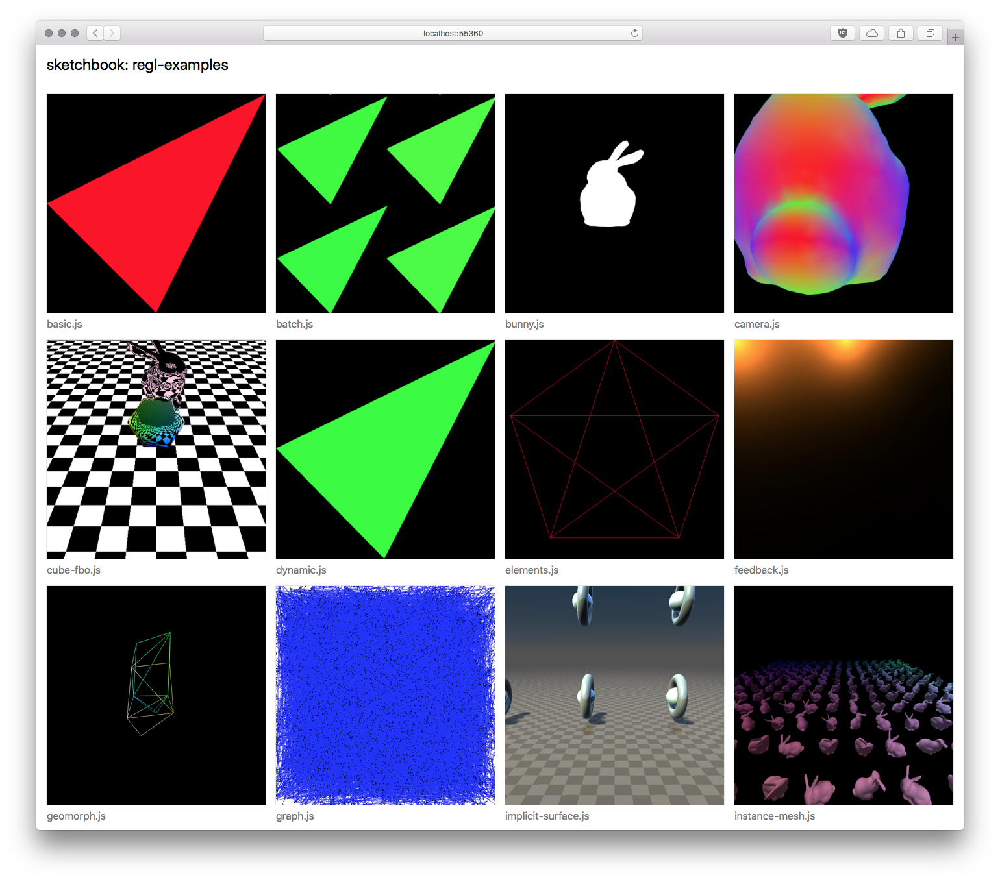

# sketchbook-cli &mdash; a place for your sketches

This is a prototyping and showcasing environment, including live-reloading and live-screenshotting of your code.

<p align="center">
  
</p>

## Installation

```bash
npm install -g sketchbook-cli
```

## Usage

Assuming that `./my-sketches` is folder of single-file javascript sketches. They will be bundled with `browserify` on the fly, and gallery view of the sketches will be generated.

```bash
sketchbook-cli ./my-sketches
```

Then open the URL that will be printed out in the console. You can open any of the gallery items by clicking on it, and editing the code behind that sketch will be live-updated.

## Options

- `--port 3000` - run on port `3000` instead of default random one
- `--no-screenshots` - disable screenshotting (useful when working on battery)

## Info

In the background, single [electron](https://github.com/electron/electron) is started, which screenshots each of the files one-by-one, and caches results in `.sketchbook_cli` folder inside of the main sketches directory. This folder ideally is in `.gitignore`.

The screenshot is generated immediately after page has loaded, which can sometimes result in white screen (while the sketch is still working). This can be controlled by adding `window.sketchbook.shot()` line somewhere in the code. **Watch out:** the way this works is done [very naively](https://github.com/szymonkaliski/sketchbook-cli/blob/master/screen-shotter/index.js#L118), so for example commenting this line out, but leaving it in the source code, will lead to the screenshot never being taken.

## Future Work

- [ ] support for `browserify` transfors
- [ ] exporting gallery to static files

I'm happy to merge PRs!

## Acknowledgments

Most of the live-reload code was stolen from [budo](https://github.com/mattdesl/budo).

This project was developed in part at Laboratory, an artist residency for interactive arts: [https://laboratoryspokane.com](https://laboratoryspokane.com).
